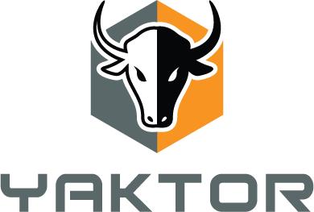

# Documentation

## Introduction

This is the documentation for the Yaktor tools and framework.

The documentation may currently be slightly out of date because of the move to open source and the introduction of docker.
We are updating the documentation and will try to make sure that the documentation remains accurate.

If you find errors in the documentation, please let us know!

## Getting started

There are multiple ways of getting started with Yaktor.

- **The easy way**: Use Docker
  - InstaLll Docker
  - Pull the yaktor image from the Docker Hub
- **The hard way**: Install the dependencies one-by-one, which requires separate installations of:
  - Node.js
  - MongoDB
  - Java
  - Ruby
  - ActiveMQ
  - AsciiDoctor
  - Graphviz
  - Cassandra

For now, we'll focus on the easy way. Follow [these steps](DockerInstall.md) to get started.

## Documentation site

In addition to this repository, we have a website where we generate documentation from this repository.

The documentation site can be found at http://yaktor.io

## Install the editors

Your productivity may increase significantly by using Yaktor's custom editors.

[This article](eclipse/ConfigureEclipse.md) explains how to get the editors up and running.

## Tutorials

Here are some tutorials:

- [Installing Yaktor on Docker](DockerInstall.md)
- [Understand the demo.cl file](YaktorInitialTemplate.md)

You can also read some more about Yaktor by browsing the documents in this repository (see under documentation/src/asciidoc/)
 
 We are also generating a more stylish version of the above link here http://scispike-elearning.com/yaktor/docs/ (we are working on the CI pipeline for the generation of the documentation. If it is down, we apologize. Please check back in a few hours and it'll be there...)
