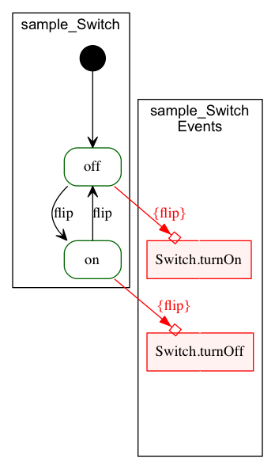
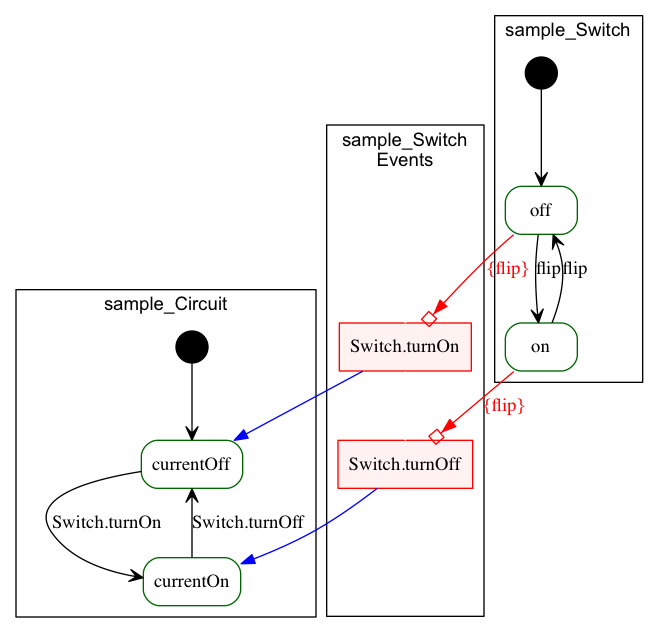

# Create a conversation

## Introduction

We'll create a new conversation from scratch and discuss the various components that makes up a conversation.

## Prerequisites

We assume that you have already created a yaktor project and have all the required tools installed.

## Steps

### 1. Create a conversation language (`cl`) file

Using your favorite editor, open a new file named `sample.cl` in the root of your project.

### 2. Name the `conversation`

Every conversation has to be surrounded by a conversation definition as seen below:

```
conversation sample {
  /*
   * All the content will be placed here
   */
}
```

This creates a new conversation called sample.
Note the use of the c-style comment `/* */`. You can also add comment with `//`,  which makes a comment to the end of the line. E.g.:

```
  // This is a comment
```

### 3. Define a type

Next we'll define a simple type.
There is a long story around the concepts of types, however, for now, let's simply create a type and move on.

```
conversation sample {
  type Installation {    
  }
}
```

Notice that the types are defined with the keyword `type` followed by the name of the type and the open/close parenthesis.

### 4. Define your first agent

Next we'll add an agent.
An agent is a software module that can receive and send messages.
Agents have a notion of a state machine that controls its behavior.

```
conversation sample {

  type SampleType {    
  }

  // This is the agent
  agent Switch concerning Installation {

    // the initially means that when created it starts off in the state off
    initially becomes off {

      // defines the off state
      off {
      }

      // defines the on state
      on {
      }
    }
  }
}
```

In this case I've defined an agent called `Switch` that has two states, `on` and `off`.

### 5. Define a private event `flip`

We want to allow for the Switch to be flipped (from on to off and back to on and so on).

We'll define a event `flip`. The `flip` event will be defined as `privately receives`. That is, the agent itself will generate and consume the event.

```
agent Switch concerning Installation {

  privately receives flip

  // as before
}
```

### 6. Define the behavior for flip

When we flip the switch, we want the switch to change state.

We can define the change of state in two ways.
One is slightly more verbose than the other and we'll show both versions below (verbose in the state off and sparse in the state on).

```
agent Switch concerning Installation {

  privately receives flip
  initially becomes off {
    off {
      // when we receive flip in the state off, we change our state to on
      receives flip becomes on
    }
    on {
      // when we receive flip in the state on, we change our state to off
      flip -> off
    }
  }

}
```

7. Produce events from the switch

Next we want to make sure that the Switch produces events that other agents can listen to when it is being flipped.

We will define two events `turnOn` and `turnOff`. We want the `turnOn` event to be produced when we flip the switch to `on` and the `turnOff` event to be produced when we flip the state to off.

Again there is a verbose and a sparse way to define this:

```
agent Switch concerning Installation {
  privately receives flip

  // Produce these events
  sends turnOn
  sends turnOff

  initially becomes off {
    off {
      receives flip becomes on sends turnOn
    }
    on {
      // when we receive flip in the state on, we change our state to off
      flip -> off > turnOff
    }
  }

}
```

### 8. Infinite vs finite

For the agent to be complete we have to add one more keyword `infinite`. This require some discussion.

By default, we consider agents to be finite, which means that they have a clear end-state (a state where it stops reacting to incoming events).

The switch that we defined doesn't have such a state.
We therefore seem to have defined a switch that lives forever.
We could fix this by adding some end-states (e.g., say a state of `uninstalled`), however, we'll rather use the opportunity to introduce the idea of a infinite agent.

An infinite agent is a agent that lives through the lifetime of an application. The `infinite` keyword is placed in front of the `agent` keyword.

E.g.:

```
infinite agent Switch concerning Installation {
```

#### 9. Completed switch

Your source code should now look something like this:

```
conversation sample {
  type Installation {
  }

  infinite agent Switch concerning Installation {

    privately receives flip
    sends turnOn
    sends turnOff

    initially becomes off {
      off {
        receives flip becomes on sends turnOn
      }
      on {
        flip -> off > turnOff
      }
    }
  }
}
```

If you looked inside the generated visualization you should now see something like this:

<

What we have defined is an agent (or a module of software) that is able to produce two events, `turnOn` and `turnOff`.

Internal to the agent, it handles an event we call `flip`.
The behavior on `flip` depends on which state the switch is in.

We have two states, `on` and `off`. We've defined the following rules:

- If a switch is in the `off` state and it receives the `flip` event, it will produce the event `turnOn` and change state to `on`.
- If a switch is in the `on` state and it receives the `flip` event, it will produce the event `turnOff` and change state to `off`.

### 10. Defining a second agent that listens to the events

Let's now say we want to create a second agent. This agent listens to the switch and turn on and off the current of some circuit when the switch is flipped.

We'll call this agent `Circuit` and it would have the states `currentOn` and `currentOff`.

Here is a starting point for this agent:

```
infinite agent Circuit concerning Installation {

  initially becomes currentOff {
    currentOff {

    }
    currentOn {

    }
  }
}
```

### 11. Understanding the `concerning` keword

We silently defined that the agents `Switch` and `Circuit` both are related to the type `Installation`.

There is a long story behind this also, but for now, just think of it as if the `Switch` and `Circuit` are both related to the same `Installation`, they will work together.

### 12. Subscribing to `Switch` events

We now want the `Circuit` to listen to the events from the `Switch`.
The behavior we want for the Circuit is:

- When the switch sends out `turnOn` we want the current to flow
- When the switch sends out `turnOff` event, we want the current to be shut off

Here is how we do that:

```
infinite agent Circuit concerning Installation {

  initially becomes currentOff {
    currentOff {
      // verbose definition
      receives Switch.turnOn becomes currentOn
    }
    currentOn {
      // terse definition
      Switch.turnOff -> currentOff
    }
  }
}
```

### 13. The complete definition

Here is a complete definition of the `sample.cl` file:

```
conversation sample {

  // Type that ties the agents together
  type Installation {
  }

  // A switch
  infinite agent Switch concerning Installation {

    privately receives flip
    sends turnOn
    sends turnOff

    initially becomes off {
      off {
        receives flip becomes on sends turnOn
      }
      on {
        flip -> off > turnOff
      }
    }
  }

  // A circuit
  infinite agent Circuit concerning Installation {

    initially becomes currentOff {
      currentOff {
        receives Switch.turnOn becomes currentOn
      }
      currentOn {
        Switch.turnOn -> currentOff
      }
    }
  }
}
```

If you open the visualization, you may see something like this:




### 14. Try it out

Generate the code and run the server.

```bash
$ npm run gen-src
$ npm start
```

Launch your browser on:

  http://localhost:8000/test/sample.html
