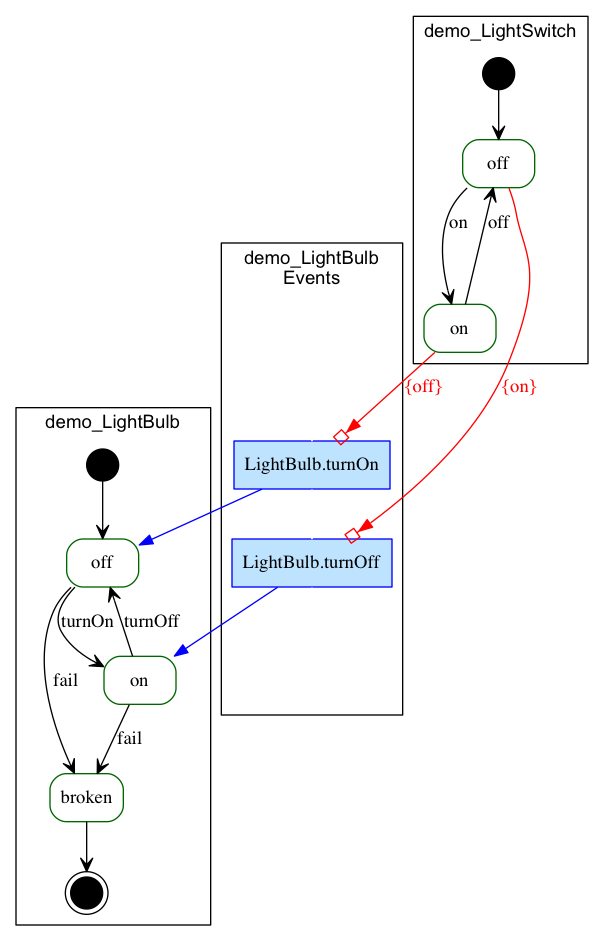

# Create a new Yaktor project

## Introduction

In this demo we'll show how to create a Yaktor project from scratch and create a simple conversation to verify that it all works.

## Prerequisites

We assume that you have installed Yaktor and all its dependencies.

## Steps

### 1. Create a Yaktor project

Yaktor provides a set of tools that should be available from your terminal.

First open a terminal and type:

```bash
$ yaktor create demo
```

You should see a set of output in the terminal window as the Yaktor tools creates your project and the required tools.

Assuming you used `demo` as the name, you should now see a directory `./demo` where you ran the command.

cd into this directory.

```bash
$ cd demo
```

The project you've created is a node.js project.
If you are familiar with node.js, you should recognize most of the artifacts created.
If you're not familiar with Node.js, don't worry.
You should still be able to follow along.

### 2. Install dependencies

As part of the `yaktor create` command, we ran a command to download dependencies.

A typical node.js project depends on a set of modules.
We can download and install these with a simple command (should not be required unless you were offline when you created the project):

```bash
$ npm install
```

### 3. Create a simple conversation

Yaktor introduces a language called `conversation language`.
To have Yaktor do something useful, you should provide at least one of these cl files.

The following file contains a simple example:

```
conversation demo {
    type Lighting {
    }

    agent LightBulb concerning Lighting {
        privately receives fail
        receives turnOn
        receives turnOff
        initially becomes  off {
            off {
                receives turnOn becomes ^on
                receives fail becomes broken
            }
            ^on {
                receives turnOff becomes off
                receives fail becomes broken
            }
            broken {

            }
        }
    }
    infinite agent LightSwitch concerning Lighting {
        privately receives ^on
        privately receives off
        initially becomes off {
            off {
                ^on -> ^on > LightBulb.turnOff
            }
            ^on {
                off -> off > LightBulb.turnOn
            }
        }
    }
}
```

Copy the content above and paste it into a file you can call `demo.cl` and place it in the root of your project (you can actually organize the `cl` files any way you want to, but for now, let's put the files in the root).

We can go into this simple file in details later.
For now, let's highlight a few things:

- We have two agents (aka, actors), `LightBulb` and `LightSwitch`.
- Each have a defined state machine (defined in the section starting with `initially becomes`)
- The `LightBulb` can receive two messages `turnOn` and `turnOff`
  - When it receives `turnOn` whilst in the state `off` it changes state (becomes) `on`

### 3. Generate code

The yaktor tools can be used to generate a set of artifacts from the `cl` files.

To generate code simply run:

```bash
$ npm run gen-src
```

### 4. Take a look at the visualization

We always try to visualize the the behavior of the conversations.

If you have [graphviz](www.graphviz.org) installed, you can directly view our `dot` files.
The `dot` files are placed in:

  `./src-gen/dot/fsm/`

The always have the same name as the conversation. In our example, that would be:

  `./src-gen/dot/fsm/demo.dot`

If you don't have graphviz, you can try to open the html file generated.
The html file generated is in the same directory and in our case would be called:

  `./src-gen/dot/fsm/demo.html`

The visualization should look something like this:

<

The visualization shows that our two agents, their state machines and the event relationship between them.

### 5. Start the server

Next let's take a look at what we've created.

To do so, run the following command to start the server.

```bash
$ npm start
```

### 6. Try out the conversation

Open the following URL in your browser:

  http://localhost:8000/test/demo.html
