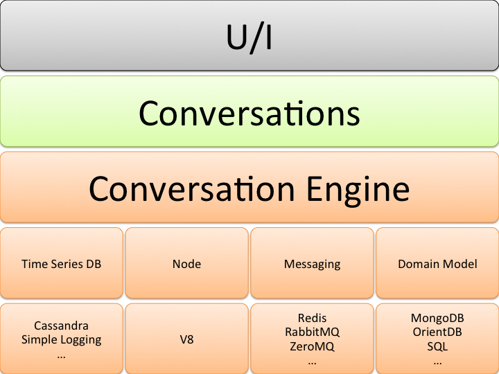

= Conversation Architecture

== Introduction

When you use the conversation language to define your application, the tooling will drive you towards a particular architecture.
The architecture is a variation on what's often called *_Lambda Architecture_*.

The Lambda Architecture seems a bit misnamed and the match is not 100%, so we'll not assume prior knowledge of it. We will explain the Yaktor Conversation Architecture instead.
The architecture was not really inspired by the Lambda Architecture and it is not until after the tooling was done that we found the correlation.

== A Bit of History

Late 2012 SciSpike wanted to build a system that allowed the use of Smart Phones for payment at gas stations.
Petter Graff and Jonathan Kamke scoped out the problem and Jonathan (with help of Barrett Cervenka) started the implementation.

Spring 2013, Petter met with Jonathan in Seattle to take a look at what had been done.
Although Petter recognized the beauty of the way the application was built, he also found the application to be somewhat hard to understand.
After some discussion (read hours of head-butting :)), Jonathan and Petter set forth with a few goals.

We would build a framework where:

* The performance and scalability was not compromised in any way
* The 'workflow' of the application was a first class citizen
* Tooling would make the framework easy to use and understand

After scoping out the initial language, Petter and Jonathan started down the road of building out the tooling and adjust the framework accordingly.
The primary target was Node.js.
Node.js seemed like a very good platform for what we tried to achieve, but we wanted to make sure we did not get locked into Node.js (Erlang, Scala with Akka, Vert.x, etc. are also technologies where the ideas would work well).

Under Petter's supervision and with Barrett's input, Jonathan started the long road towards what we have today.

== What's the Problem We're Solving?

To build highly scalable systems it is important to maximize parallelism, minimize synchronization and focus on dynamic scale (up or down).

Setting goals is easy, but how do you achieve them?

=== Lessons From Real-Time Systems
In real-time systems, they've had success with a model often called the 'Actor Model'.
The idea is that you distribute the load of a transaction to a set of actors that process requests in parallel.
The actors are often stateful and they always communicate asynchronously.

The problem with this model is that it is very hard to program.
You often end up with very interdependent actors.
The agents are not necessarily all that complex in their implementation, but the logic can often depend on the state of a set of other agents that act independently.

Another interesting thing in the actor model is that you try to avoid synchronized states as much as possible. That is:

* Avoid shared memory between the actors.
* Avoid synchronization of agents through the database.
* Prefer immutable data being passed between the actors.
* It a request requires context to be correctly processed, let the agent hold the state.

[NOTE]
We would like to use the actor model, but it is very hard to program!

=== Lessons From Workflow Systems

While the actor models may be hard to understand (or at least, their behavior is hard to infer from code / design), workflow based systems do not have this problem.

In a workflow system (BPML, etc.), the workflow or the transaction is a first-class citizen.
It is very clear from the definition of the workflow what the behavior of the system is.

The workflows have proven to be very useful way to document (as well as execute) the requirements.
In fact, they are so descriptive that often the domain experts can participate in their definitions.

Where workflows have problems is that they are typically very expensive in execution.
It is hard to make them scale as you often have to go to some central workflow executor to know what to do next.
Also, most workflow engines put the definition and the instances of the workflow in some central database that requires synchronization.

[NOTE]
We'd like elevate the workflow or business behavior to become a first class citizen, but we do not want to pay the runtime penalty of a workflow system.

=== Lessons From Time-Series Focused Systems (or Lambda Architecture)

If we knew every event that ever touched a system we would know its state.
This may seem like a bold statement, but think about it for a second.

Say for example that you want to know the balance of your bank account (or the state of the account).
If we knew every deposit and withdrawal from the account, we would easily be able to calculate the balance, right. It may be very expensive, but the balance would be certainly derivable.

Systems often loose the event history after they consume the event.
They may sometimes be available in log files etc, but often these files are hard to parse and their persistence is questionable.

If, however, you ensure you store all the events (often called time-series data), this often allows you to not only derive the state that the users are interested in today, but often we can mine historical data to answer questions that the users may ask in the future.
For example, we may ask, which day of the week do you spend most money?

[NOTE]
We'd like to promote an architecture where the time-series data is produced with high accuracy and quality so that we can mine the data for questions that the user may ask in the future.

=== Data Transferred From a System Is Often Highly Correlated to the Domain Model

The data that is interchanged between the system and its environment (e.g., a user, another system) is often structurally and semantically correlated to a canonical information model. However, it is *NOT* identical.

In one of the projects that we measured, our metrics showed that some 80% of the software effort in the back-end had to do with translating incoming and outgoing data (often called DTO's for Data Transfer Objects) to and from the canonical domain model used for the database.

Some projects we've seen they try to use the domain objects as DTO's. This often fails as we do not want to pass on all the data and often we also have additional data that is not part of the domain model (e.g. authorization tokens, session ids).

[NOTE]
We want to ensure that the DTO's and the canonical information is highly related and that as little as effort as possible is required to enforce this.

== Did We Meet Our Goals?

So, if we get back to the the goals that we marked above, they where:

* We like the actor model for it's performance and scalability, but we don't like how difficult it is to program.
* We would like to have workflows as first class citizens if we don't have to pay the runtime penalty of centralized flows
* We love the lambda architecture idea of having time-series data stored, but are afraid of the cost in terms of programming and performance.
* We would like to minimize the time-consuming work of mapping DTO's to canonical domain models

What we have done is to build a framework with a set of tools that execute the actor model, but let the programmer build workflows (or what we call _conversations_; the name change being justified because the concepts are truly different).
We produce time-series data for you automatically (no need for the programmers to be involved unless they absolutely want to).
We ensure that the DTO are the time-series data and that they also are mapped to the domain model *without* causing additional work for the programmers.

These may be bold claims, but we think when you get a feel for what we have done, you will agree.

== The Anatomy of The Conversation Engine

=== The Layers

image: layers.png[Abstract Layer Diagram]

The above diagram shows you the essential layers used during runtime.

The layers consist of:

U/I::
    On top we have some kind of user interface (or in some cases a machine API).
    The conversation engine does generate some U/I's, but in the final product, this is usually hand coded (in other words, out of scope for the conversation engine).
Conversation::
    The conversation is the application code that defines the behavior of the application.
    This code is partially generated by the Yaktor tools and partially implemented by hand.
Conversation Engine::
    This is an installed component.
    The generated code depends on this implementation.
    This layer is required for the generated code for the conversation to work.
Runtime Libraries::
    The runtime libraries contains a set of modules that are required to make the conversation engine run.
    These components are typically open-source components and vary across implementations.
Time Series::
    One required ingredient is a component that implements support for persistence of time-series data.
    The support is typically pluggable and the sophistication of the library may vary from simple logging to specialized time-series databases.
Messaging::
    The conversation engine typically depends on intra- and inter-messaging support.
    The messaging is pluggable.
Persistence::
    An application typically also need support for persistence of some canonical information (domain) model.

The diagram may vary from implementation to implementation.
For example, here is a diagram illustrating the (current) layers used for Node.js:

=== Event Processing

It is essential to understand how the conversation engine processes events.
All events that originated from a definition in the conversation engine will follow the following processing sequence.

Event Source::
    The event source may be an external event (e.g., the user interface or an external system sends us a message) or an internal event (that is, one agent publishes a message that other agents reacts to).
Persist the Event::
    The engine will make sure that all events are persisted in some time-series storage.
    It is up to the programmer to configure and take advantage of the time-series storage.
    In some cases the time-series store may be the prime database.
    In other cases, you may not be interested in the time-series data beyond simple logging.
Execute the Conversation::
    The engine will direct the event to the proper conversation and agent and ensure that it receives the event.
    What the engine does with the event depends on what you have specified in the conversation language.
Execute Application Closures::
    If you have specified an application closure (the more generic case, however, in some languages the application stimuli may take the form of a function call or a method invocation), the conversation engine will make sure that the closures are invoked.
    What you do in these closures are up to you. Perhaps you will execute a query, update some canonical domain model, send emails, post messages, the conversation engine doesn't really know.
Update Conversation State::
    The engine keeps track of all the conversations and their current state.
    After execution of one event, we have to ensure that the conversation is updated and its state persisted.
Recurse::
    The result of the application closure or engine defined behavior may be another event.
    If so, the cycle starts all over again.

=== The Tools

SciSpike has created Yaktor, a set of tools to make it easy for you to define conversations.
The tools required may vary based on the environment you are targeting.

Conversation Engine Startup Kit::
    Typically we provide a set of tools that allows you to get started.
    These tools vary with the platform you want to run the engine on.
    E.g., for Node.js, we have a conversation tool that you install with NPM.
    The tool allows you to create a correctly setup project template for new applications.
Runtime Library::
    We've mentioned this before, but for completeness, there is a runtime-component required to make the engine run.
    This runtime component is usually installable using the startup kit.
IDE::
    We provide a set of plugins to Eclipse that are essential for building conversations.
    The plugins contribute editors and code generators to the Eclipse IDE.
