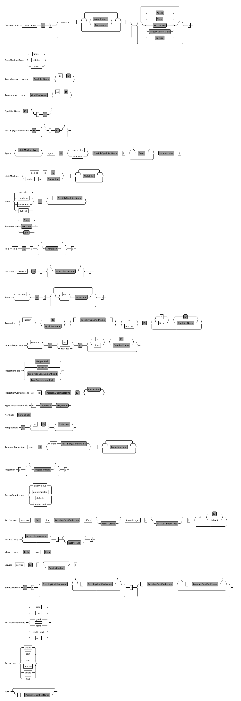

:sectanchors:
:icons: font

= Conversation Language Reference

== Introduction

Conversations are defined in files with the extension *.cl*.
They are simple text files, but they have to follow a particular format.
You may edit the text files with your favorite editor, but we strongly recommend that you use the Eclipse editor provided by Yaktor and that will provide you with autocompletion, syntax highlighting and other productivity features.

This document covers the semantics of the conversation language.
For information regarding runtime concepts please see link:artifactsAndConcepts.html[Artifacts and Concepts]
The conversation language may refer (in fact, typically refers) to another language, the Yaktor link:../../domain/reference/introduction.html[Domain Modeling Language].

== Conversation

=== Collaborative Distributed Behavior

In the space of event-driven, asynchronous, distributed, multi-party, state-based behavior there is a significant gap in
the ability to describe and constrain interaction between moving parts. Practically speaking the world of event based programming leans
either toward the tight coupling of tradition pub/sub (coupled responses) or the loose coupling of a virtual chat room.

Toward that end we provide both a communication grammar and conditional state-based behavior. Allowing user-agents (ie Web Clients or Web enabled devices)
to connect to well ordered back-end services, receive data/updates, and indicate choices and activity. Collaberation facilitated by the
conversation engine with automatic and decoupled as well as predictable and visually verifiable. It
also allows for the use of rich feature sets afforded by standard protocols like Ajax and WebSockets.

In the end what we achieve is loosely coupled (like the chat room) but with out the chaos, or predictable pub/sub without the coupling.

=== Conversation Example

Lets get started with some examples.

[source,cl]
------------------------------------------------------------
conversation MyConversation // <1>
{
    // <2>
}
------------------------------------------------------------
<1> The conversation keyword followed by the name of the conversation.
<2> We'll define the conversation inside the curly brackets

The above example is a non-populated conversation.
A *.cl* file always start with the +conversation+ keyword,
followed by the name of the conversation (_MyConversation_ in our example).
The definition of the conversation itself is defined inside curly braces.

A conversation can define a set of link:#agents[agents].
An agent is a participant in a transaction that has (at least) the following features:

* A definition of a set of link:#events[events]
* Declare a context of a link:#agent-data-type[type]
* A definition of its link:#state-machine[state machine]

Optionally, you may also define a set of dependencies and type definitions.
More about those later.

== Agents

=== Event Driven Behavior

Agents were designed to implement both the behavior and state of a system.
As such they expose rich State Model and Event modeling facility.
Let look at more closely at the anatomy of an Agent.

=== Agent Anatomy

[source,cl]
------------------------------------------------------------
conversation MyConversation {

    infinite                       // <1>
      agent SomeAgent              // <2>
      concerning SomeType          // <3>
    {                              // <4>
                                   // <5>
    }

}
------------------------------------------------------------
<1> *optional* The link:#life-cycle[Life Cycle] for this agent.
<2> The +agent+ keyword followed by the name of the agent (+SomeAgent+) in the example defines a participant in the conversation.
<3> The link:#agent-data-type[Agent Data Type] +concerning+ which data is the context of this conversation.
<4> Typically everything up to the +{+ would be declared on the same line
<5> The definition of the agent (details to follow).

=== Life Cycle

All agents have a life cycle.
The agent's life cycle is either +finite+ or +infinite+.

* An agent is +finite+ if (and only if) it has at least one reachable end state.
* If there are no reachable end states, the agent must be declared as +infinite+.

Use an +infinite+ agent if the agent instance should stay around _forever_ after being instantiated.
Use a +finite+ agent if the agent represents handles some task that can be completed.

[Note]
    Sometimes you have the option to design conversations with either finite or infinite agents.
    If given a choice, we recommend to design the conversation such that it uses finite agents.

=== Agent Data Type

Typically, agents collaborate around some information.
Each agent references some link:#data-structures[data type].

The data types of collaborating agents must be related.
The rules are:

* If the data types are identical, the case is trivial (not discussed below).
* Two agents may declare different data types even though they participate in the same conversation.
** If the Types are different, they must be derivable/mapped to each other (inheritance or composition).
*** Composition will be evaluated using a mapping on the cause side of an inter-agent transition.
This mapping may evaluate against the event data or the Type.
If no mapping exists the Type inheritance will be inferred.
* If the types are not derivable/mapped, then the agents will not receive massages from each other.

=== Event definitions

An agent may define a set of events.
An event is a definition of some stimulus that the agent reacts to or produces for other agents to react or take action on.

The event definition defines:

* The name of the event
* The nature of the event in relationship to the agent (+privately receives+, +receives+ or +sends+)
** +sends+. Means that the agent broadcasts the event. Other agents may now reacto to this event.
** +receives+. Means that we can receive this message from another agent.
** +privately receives+. Means an internal action or decision made by the agent. This event is typically produced by a user-agent (such as a browser) that acts upon the agent.
* Optionally, the type of the event (more on this later)

Example:

[source,cl]
------------------------------------------------------------
conversation MyConversation {
    agent SomeAgent {
        sends eventTypeA      // <1>
        receives eventTypeB      // <2>
        privately receives eventTypeC      // <3>
    }
}
------------------------------------------------------------
<1> SomeAgent +sends+ (or broadcasts) events of type eventTypeA.
<2> SomeAgent +receives+ events of type eventTypeB.
<3> SomeAgent +privately receives+ eventTypeC. That is, the agent (or it's user agent) may
    react to events of type eventTypeC.

=== State Machine

An agent also defines a state machine.
The state machine defines an external guarantee for how the agent behaves.
The LightBulb as described here would be expecting other agents (yet defined) to
trigger +turnOn+ and +turnOff+, and yet not know who did it.

We typically place the definition of an event where he have the most specific
details, but you have the freedom of choice. Often if you consider the analog
as well as the data requirements it is easy to see who owns the definition.
If all else fails choose consumes and refactor when you find multiple consumers.
Multiple producers and consumers requires an additional agent to act as mediator.

[source,cl]
------------------------------------------------------------
conversation MyConversation {
    agent LightBulb {
        receives turnOn
        receives turnOff
        privately receives fail

        initially becomes off {         // <1>
            off {               // <2>
                turnOn -> ^on    // <3>
                fail -> broken
            }
            ^on {                // <2>
                turnOff -> off
                fail -> broken
            }
            broken {}           // <2>
        }
    }
}
------------------------------------------------------------
<1> We use the keywords +initially becomes+ to introduce the state machine as well as the initial state the agent.
In the example, the light bulb begins +off+.
<2> Declares states (in our case, we have 3 states: +off+, +on+, +broken+).
    Notice that the state the state +on+ is written as +^on+.
    The reason is that +on+ is a keyword.
    To escape the keyword, use +^+.
<3> Defines a transition. A transition is defines as +eventName+ +->+ +resultingState+.
In this example, we are saying that "If the light bulb is in the state +off+ and the +turnOn+ event happens, then the light bulb will change to the state +on+."
We are using an abbreviated syntax here. An alternative syntax is perhaps more descriptive.
You could have written the same statement as:
    +on+ turnOn +reaches+ on

=== Dependencies

It is possible for agents to subscribe or produce events to agents defined in other conversations.
If they do, they have to declare their dependency on the other agents.
It is important to note that you *only* have to declare dependencies on external agents (or agents defined in other conversations).

[source,cl]
------------------------------------------------------------
conversation MyConversation {
    imports {
      agent SingleSwitchCircuit.PowerSwitch as Switch // <1>
    }
    agent LightBulb {

        initially becomes off {
            off {
                Switch.turnOn -> on // <2>
            }
            on {
            }
        }
    }
}
------------------------------------------------------------
<1> Here we have declared a +dependencies+ block and declared a dependency on an agent called +Switch+.
<2> Because we imported the +Switch+ we are now allowed to consume events from the switch.

=== Agent Example

==== Description

In this example we have defined two agents:

* A switch
* A light bulb

The two agents have been defined in separate conversations.
We may have preferred to define both in the same conversation, but without doing so, we would not be able to show the definition of dependencies.

Both agents have a simple state machine (basically they are either +on+ or +off+, but we added +broken+ also to the light bulb).

There is an event dependency between the two actors.
We want the light bulb to change state when the switch state is changed.
We have specifically chosen to reverse the +produces+ +consumes+ relationship of +turnOn+ and +turnOff+
to convey the notion of data flow and control of the +Switch+.

==== Switch

[source,cl]
------------------------------------------------------------
conversation s {
    agent Switch {
        sends turnOn              // <1>
        sends turnOff             // <1>
        privately receives on                  // <2>
        privately receives off                 // <2>

        initially becomes off {
            off {
                on -> on > turnOn       // <3>
            }
            on {
                off -> off > turnOff    // <3>
            }
        }
    }
}
------------------------------------------------------------
<1> The switch sends events that the light bulb may consume (when it is turned on or off)
<2> The switch is capable of telling when it has been turned on or off
<3> We are also specifying the event transitions, but notice that we now have an additional syntax construct +>+.
This specifies when the +Switch+ produces such events.

==== Light Bulb

[source,cl]
------------------------------------------------------------
conversation lb {
    imports {
        agent s.Switch              // <1>
    }
    agent LightBulb {
        privately receives broken

        initially becomes off {
            off {
                Switch.turnOn -> on     // <2>
            }
            on {
                Switch.turnOff -> off   // <2>
                broken -> broken
            }
            broken {

            }
        }
    }
}
------------------------------------------------------------
<1> The +LightBulb+ has to declare a dependency on the +Switch+ to be able to subscribe to the events it produces.
<2> The +LightBulb+ changes state when the +Switch+ produces the events +turnOn+ or +turnOff+.

== Data Structures

=== The Problem

An event may carry a set of information. To ensure compliance (that is, a consistent interpretation on both the producer and the consumer side), we have to be able to specify the structure of this information.

We'll refer to the definition of this data structure as *DTOs* (Data Transfer Objects).

It is important that the DTOs are based on some canonical information model for the complete system.
The reason for this is to ensure that related information is kept consistent.

For this reason, we have also created a language for defining these canonical information (we call these *Domain Models*).
We recommend two paths for creating DTOs, either build them first apart from the domain model and then link them together as appropriate.
You could also follow the creation of the Domain Model and link DTOs as you build them. You could also mix these approaches as necessary.

The construction of the domain model is covered in the (link:../../domain/reference/introduction.html[Language Reference for Domain Models]).
We will assume in the following text that you already understand how to construct domain models.

The type language should be quite trivial to most programmers.
It is fairly consistent with the way you would define data structures in other languages.
The type language supports:

* Definition of types
* Definition of data fields
* Definition of a hierarchical structure (no support for graphs)
* Definition of cardinality of fields
* Definition of constraints on fields
* Referencing entities from the domain model
** Whole types may be derived/mapped from/to entities (using nested +{+ +}+)
** Single field references to an entity (using +ref+)
* Containment of other types (using +val+).

=== Defining a Type

You may define the rules for a data structure. This data structure:

* Is an external facing contract of a data structure
* May map to a link:../../domain/reference/introduction.html#entities[Domain Entity]

Let's start by showing an example:

[source,cl]
------------------------------------------------------------
conversation MyConversation {

    type SomeEventData { // <1>
        Date whenSent! // <2>
        String someMessage? // <3>
        val SomeOtherData other* // <4>

        val Domain.SomeType someDomainType {} // <5>
    }
    type SomeOtherData {} // <6>
}
------------------------------------------------------------
<1> The declaration of a type (here called +SomeEventData+)
<2> Example of a declaration of a date field. The exclamation mark means that the field is required.
<3> Example of a declaration of a string field. The question mark means the field is optional.
<4> This field contains an array of contents as defined by another DTO (This one happens to be empty).
<5> This field contains content as defined by a link:../../domain/reference/introduction.html#types[Domain Type].
Notice it must have +{}+
<6> +SomeOtherData+ type convenient for the +other+ field.

==== Fields

A type contains a set of what we call *fields*.
A field is constrained by the same language as defined in link:../../domain/reference/introduction.html#fields[Domain Fields], which goes into field definition in detail.

In short you can use:

* Its type (e.g., Date, String, etc.)
* Its name (a continuous token)
* Various constraints, including:
** Cardinality (required, optional, many, one or more)
** Value constraints (regex for strings, value ranges for integers, etc.)

The format of a field is:

+Field Type+ +Type Name+ +[Cardinality]+ +[Type Specific Constraints]+

=== DTO's Based on Domain Model Entities

The most typical way to define DTO's is to base the DTO on an entity in your domain model.

When you've identified which entity in the domain model you want to base your DTO on, you now need to figure out which fields you want to include from the entity.
We declare mapping and projections in the following way.:

* Projections are defined on any reference in the mapped model .
** A projection mapping may be empty represented by +{}+.
*** resulting in mapping to all of the fields "flat".
*** This will include references but will not recurse down (IDs only).
*** +type+s will be expanded as though they were named with {}
* A projection mapping which includes _any_ field will restrict the projection to only include the mapped fields.
** If you want all fields, you will need to map all of them, or have an empty projection mapping.
** A mapping to a reference field without declaring a sub-mapping will result in just a reference
** A mapping to a +type+ must be followed by +{}+ (as this is the only reasonable thing to do:)
*** If you wish to limit or deepen the mapping fill in the +{}+
** Mappings to a reference field which lack +{}+ will be mapped flat.
* You may establish a reference to an entity with a +ref+ field. Which will always be a flat reference.
* You may establish containment of a type with a +val+ field with +{}+ same rules as above.

So, let's start with a simple domain model

[source,dm]
------------------------------------------------------------
domain-model MyDomainModel {
    entity Company {
        Address address
        String name!
    }
    entity Opening {
        Date startDate?
        String name!
        String description!
    }
    entity Candidate {
        String firstName!
        String lastName!
        String resume!
    }
    association Company2Openings {
        start Company company!
        end Opening openings*
    }
    association Opening2Candidates {
        start Opening opening!
        end Candidate candidates*
    }
}
------------------------------------------------------------

Now, let's say we have the need to define a DTO that sets up a position.
We have a domain model, called +Opening+ that we can use as the base.

[source,cl]
------------------------------------------------------------
conversation HR {
    type NewOpening from Opening {} // <1>
}
------------------------------------------------------------
<1> A DTO called +NewOpening+ which is derived from the domain object Opening.

We would now expect an opening that follows the exact same structure as the opening.
In other words, it would be the same as if we defined a type as follows:

[source,cl]
------------------------------------------------------------
conversation HR {
    type NewOpening from Opening {
        startDate //<1>
        name //<2>
        description
        candidates //<3>
    }
}
------------------------------------------------------------
<1> mapping of the Date field startDate
<2> mapping of the String field name
<3> mapping array of references (ids) for candidates

What if we only wanted to bring in a subset of the properties from the Opening and alter the presentation?
Say we only wanted the +startDate+ and rename +name+.

No problem, we can simply open some curly braces and define the mapping.

[source,cl]
------------------------------------------------------------
conversation HR {
    type AvailablePosition from Opening { // <1>
        startDate
        name as openingName      // <2>
    }
}
------------------------------------------------------------
<1> Specifies that we want to include the +startDate+ and +name+ fields
<2> Specifies that we want to include the +name+ field under the name of +openingName+

Now, perhaps we need to provide an attribute that does not exist in the domain model.
Say for instance that we want to pass in some additional information

[source,cl]
------------------------------------------------------------
conversation HR {
    type AvailablePosition from Opening {
        startDate
        name
        String authToken! // <1>
        ref Opening previouslyViewed* //<2>
    }
}
------------------------------------------------------------
<1> Specifies that we require a String field; +authToken+.
<2> An optional list of references (key or _id) of to the +Opening+ collection;

Notice that in the examples so far we made shallow definitions of the DTO.
That is, we did not include objects linked to the domain object.
What if we wanted to see a position with all the candidates?

[source,cl]
------------------------------------------------------------
conversation HR {
    type AvailablePosition from Opening {
        startDate
        name
        String authToken!
        candidates {} // <1>
    }
}
------------------------------------------------------------
<1> Specifying that we also want to include all fields from candidates (i.e. Populate candidates).

In the example above, we would get all the attributes of the candidate.
What if we only wanted the first and last name of the candidate?

[source,cl]
------------------------------------------------------------
conversation HR {
    type AvailablePosition from Opening {
        startDate
        name
        String authToken!
        candidates {
            firstName   // <1>
            lastName    // <1>
        }
    }
}
------------------------------------------------------------
<1> Notice that we can simply specify any available field what we want from +Candidate+.

== Defining Event Data

We've seen how we can define data structures.
We said that the data structures would be used to define DTO's.
The DTO's are used to pass information.
Let's now look at where we would use these DTO's.

=== Typed Events
Each of the events may be typed.
What we mean by that is that an event may carry data.

Say we have a conversation agent as below:

[source,cl]
------------------------------------------------------------
conversation HR {
    agent ApplicationHandler {
        consumes jobApplicationReceived

        begins in idle {
            idle {
                jobApplicationReceived -> processingApplication
            }
            processingApplication {

            }
        }
    }
}
------------------------------------------------------------

The +jobApplicationReceived+ event would probably have to carry the information about the candidate.

We could now define a DTO and type the event as follows.

[source,cl]
------------------------------------------------------------
conversation HR {
    type JobApplication from Candidate {                        // <1>
        firstName
        lastName
        resume
        opening {
            name
        }
    }
    agent ApplicationHandler {
        consumes jobApplicationReceived : JobApplication     // <2>

        begins in idle {
            idle {
                jobApplicationReceived -> processingApplication
            }
            processingApplication {

            }
        }
    }
}
------------------------------------------------------------
<1> Notice that we've derived the JobApplication from the Candidate.
<2> Here we type the event by simply adding +: JobApplication+

== RMI

=== Resources

In general, resources link:#resource-function-supported[CRUD] a DTO. For example a JSON PUT over HTTP.

Agents act on DTOs as well, using sockets for RMI. However, we wish to reserve Agents for more =interesting= logic.
When your RMI is not behavior oriented but more-or-less data entry and retrieval tasks use a =resource=.
To make this more compelling we have baked in some best practices and reasonable default implementations for persistence logic and paging.
That would be tricky at best over sockets and would pollute your event/state model with unnecessary stuff.

We've already seen how we can add DTO's, so let's step right into it.

[NOTE]
When we define resources, we generally intend link:#resource-function-supported[CRUD] to be consumed programmatically,
but using the proper link:#resource-function-supported[action] along with +text/html,application/xhtml+xml+ you can allow the consumption by a browser user-agent.

[NOTE]
Resources may be implemented using a more complex protocol such as SOAP,
but due to limitations of this spec there may be a number of assumptions required before this would work.

[WARNING:]
Religion Alert. We don't subscribe to REST.
However, we have followed sound principles which have proven useful to many.
On the other hand, if you think some behavior makes sense in a resource, =go for it=.
Be on the lookout for link:#services[Services], those are intended for non-event-driven behavior.

=== Resource Example

[source,cl]
------------------------------------------------------------
conversation HR {

    type Application from Candidate {
        firstName
        lastName
        opening {
            name
            company {
                name
            }
        }
    }
    resource                            // <1>
      /applications                     // <2>
      for HR.Application                // <3>
      offers (read find)                // <4>
      interchanges ( json ) // <5>
}
------------------------------------------------------------
<1> The +resource+ begins the declaration for an endpoint (a typical resource is all on one line).
<2> The URL for this endpoint will be +/application+
<3> defines +Application+ will be the DTO interchanged across actions for this resource
<4> The actions supported for this resource
<5> The mime-types supported by this resource

The resulting resource will:
* be available under the URL fragment of /applications
* produce and consume the DTO of +HR.Application+
* support the +read+ and +find+ action (and therefore is read-only)
* produce and consume data according to the mime-type +application/json+

=== Resource Function Supported

[cols="1,2,3", options="header"]
|===
|Action
|HTTP
|Semantic

|+create+
|POST
|Allow for creation of new resources, or form action="post".

|+read+
|GET
|Allow users to read (or lookup) resources based on their +id+.

|+update+
|PUT
|Allow users to modify a resource by posting updates based on their +id+.

|+delete+
|DELETE
|Allow users to delete resources based on their +id+.

|+find+
|GET
|Provide a search API for the resource or, by extension, allow basic get functionality.

|===

=== Mime Types Supported

[cols="1,2,3", options="header"]
|===
|Keyword
|Type
|Semantic

|+json+
|application/json
|Interchange JavaScript Object Notation (JSON)

|+xml+
|application/xml
|Interchange XML

|+yam+
|application/yaml
|Interchange YAML

|+text+
|text/html,application/xhtml+xml
|Interchange html (ususally produced but not consumed).

|+form+
|application/x-www-form-urlencoded
|Standard form post

|+multi-part+
|multipart/form-data
|Complex form data (file uploads)

|===

== Grammar

