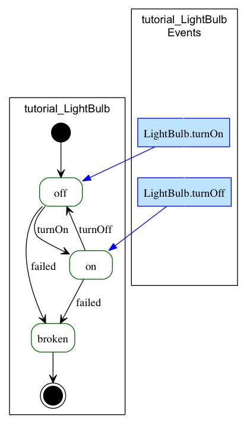
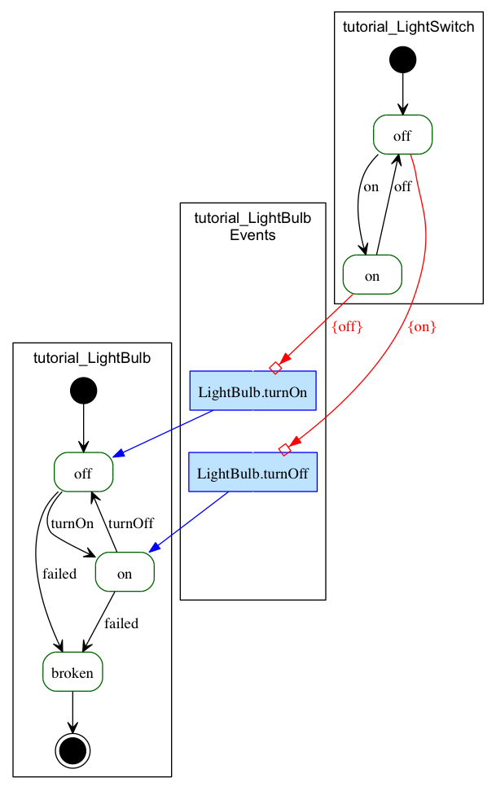
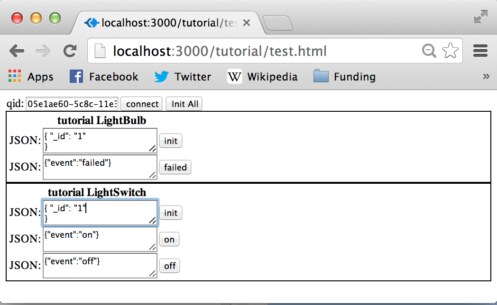
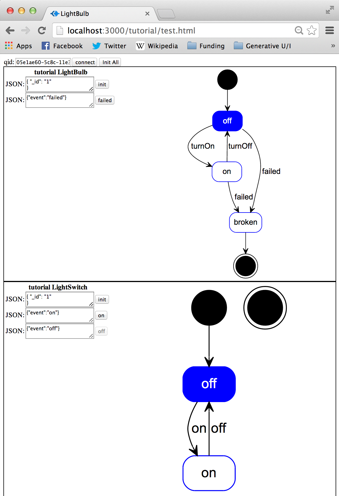

= Tutorial: Lighting

== Prerequisites

This article assumes you know how to:

* create a new conversation project
* define a conversation dsl file
* edit the conversation dsl in eclipse
* understand how to run conversation project in node and start up the conversation project's dependencies.

== Introduction

In this tutorial we'll take a look at a simple conversation between a light bulb and a switch.

Although the modeling part of this tutorial is reusable for any platform, the example is using node.js and all references to running projects or code has to be changed if you're using a different platform.

Assumed starting point:

* You have a project created (using the conversation npm tool)
* You are editing the files inside a version of Eclipse with the SciSpike extensions installed
* You already have the required servers running (Cassandra, Mongo).

This tutorial is also available as a video.
The video may be using a version of the language and tools that are slightly out of date (we update the text before the video), but you may find it useful

The video can be found here:

* http://vimeo.com/81465554[Video Tutorial for the LightSwitch on Node]

== Creating a Light Bulb

A light bulb is a simple device that in our case will have only 3 states:

* +on+. The light is on.
* +off+. The light is off.
* +broken+. The bulb is broken. This would be a final state for which there is no possible fix.

One could imagine a light bulb with other states (e.g., for dimming, color, etc.), but we'll use a simple light bulb.

We'll also assume that as a light-bulb we subscribe to a few external events:

* +turnOn+. Only applicable when the light-bulb is +off+. If +off+, it changes the state of the light bulb to +on+.
* +turnOff+. Only applicable when the light-bulb is +on+. If +on+, it changes the state of the light bulb to +off+.

We also have one internal event (internal meaning, we don't require external stimuli to produce / consume this event).

* +failed+. The event causes the light bulb to go to the +broken+ (no matter if it is +on+ or +off+).

In the conversation language this would be defined as follows:

[source]
--------------
conversation tutorial {
    agent LightBulb {        // <1>
        privately receives failed     // <2>
        receives turnOn      // <3>
        receives turnOff     // <4>
        initially becomes off {         // <5>
            off {                 // <6>
                turnOn -> ^on     // <7>
                failed -> broken  // <10>
            }
            ^on {                 // <8>
                turnOff -> off    // <9>
                failed -> broken  // <10>
            }
            broken {              // <11>

            }
        }
    }
}
--------------
<1> Our only agent in our case is the light bulb.
<2> The event +failed+ is internal to the light bulb.
    It will not be seen by other agents.
    we use the keywords +privately receives+ to express this
<3> The +turnOff+ event is something we will receive.
    Some other agent will have to send this event.
    We use the keyword +recieves+ to define this semantics.
<4> The +turnOn+ is similar to the +turnOff+.
<5> The keywords +initially becomes+ define the initial state for this agent.
    We specify that the lightbulbs start in the state +off+.
<6> Definition of the state +off+.
<7> The event +turnOn+ (when in state +off+) will make us change state to +on+.
<8> Definition of the state +on+.
    Notice in this definition that we are using the hat (^) in front of the state definition.
    This is because +on+ is a keyword in the language.
    The hat is used to escape keywords.
<9> The event +turnOff+ (when in state +on+) will make us change state to +off+.
<10> Both from state +on+ and +off+ we will change state to +broken+ when the event +failed+ occurred.
<11> Definition of the end state +failed+ (end state because there are no transitions out).

This can be visualized as follows (and if you look in the generated visualizations, you should see a similar or identical rendition):

Notice in the diagram that we have a standard UML statechart that visualizes the states of the lightbulb.
We have also added some notation that is not standar UML.
We describe the public events in a separate box.
Why will become obvious as we introduce new agents.
The events tie the agent together.

== Adding a Switch

We can now add a simple switch.
The switch would have two simple states; +on+ and +off+.
It is an +infinite+ agent (in other words, we assume it never breaks).

We'll make the switch know about the light bulb.
This may be a bit strange domain wise and we'll show you how we could make a broker agent later in this article. For now, however, we'll let the switch know about the light bulb.

[source]
--------------
conversation tutorial {
conversation tutorial {
    agent LightBulb {
        privately receives fail
        receives turnOn
        receives turnOff
        initially becomes off {
            off {
                turnOn -> ^on
                fail -> broken
            }
            ^on {
                turnOff -> off
                fail -> broken
            }
            broken {

            }
        }
    }
    infinite agent LightSwitch  { // <1>
        privately receives ^on             // <2>
        privately receives off             // <2>
        initially becomes off {
            off {
                ^on -> ^on > LightBulb.turnOff  // <3>
            }
            ^on {
                off -> off > LightBulb.turnOn   // <4>
            }
        }
    }
}
--------------
<1> We define another agent called +LightSwitch+.
    Notice that this agent is defined as +infinite+.
    Infinite here indicates that the agent does not have an end state.
<2> It has two events that are both internal: +on+ and +off+.
<3> The +on+ event when +off+ flips the state to +on+ and publishes the event +turnOff+ to the light bulb.
<4> The +off+ event when +on+ flips the state to +off+ and publishes the event +turnOn+ to the light bulb.

The current conversation can be visualized graphically this way:

== Defining the Root Type for the Conversation

Every conversation needs some root data type.
In our case, we don't really have anything interesting to store, but we still need the type.
this type will hold a correlation ID (injected) at runtime at minimum.

Let's just create a dummy object with nothing in it for now.

This leads us to the following listing:

[source]
-----------
conversation tutorial {
    type Lighting {     // <1>

    }
    agent LightBulb concerning Lighting { // <2>
        privately receives fail
        receives turnOn
        receives turnOff
        begins in off {
            off {
                turnOn -> ^on
                fail -> broken
            }
            ^on {
                turnOff -> off
                fail -> broken
            }
            broken {

            }
        }
    }
    infinite agent LightSwitch concerning Lighting { // <2>
        privately receives ^on
        privately receives off
        initially becomes off {
            off {
                ^on -> ^on > LightBulb.turnOff
            }
            ^on {
                off -> off > LightBulb.turnOn
            }
        }
    }
}
-----------
<1> We define a simple type that becomes the conversation root.
    Normally this type would have a set of data, but we'll just create a simple empty type in this example.
<2> We define that both agents work on this basic type.
    We specify which object by using the keyword +concerning+.
    This allows us to correlate the two collaborating agents at runtime.

== Running the Conversation Test

If you are setup to generate node code, we should already have sufficient generated artifacts to test out the conversation.

Let's go to the command line and run node.

[source, shell]
--------------
$ npm start
--------------

Now open your browser on (assuming you have everything set to default and if you don't, you probably know how to change the URL to your setting):

    http://localhost:3000/tutorial/test.html

You should see a screen (similar to) the one below:

Before we can try out the conversation, you'll have to connect to the agents and initialize them.

. Click the +connect+ button on the top left
. Click the +initAll+ button right next to the +connect+ button

You should now see the following web page (or something similar):

You can now start doing simulation.
