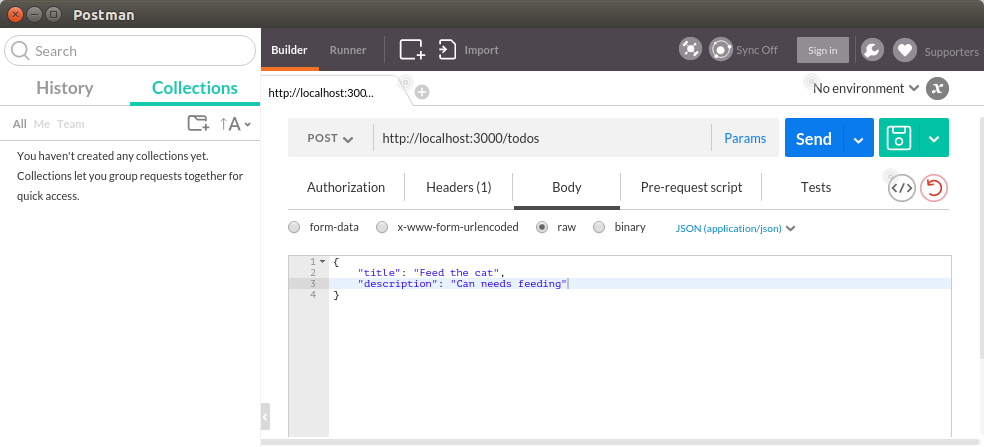
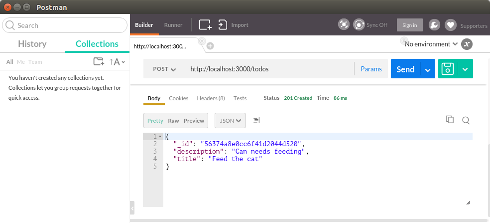
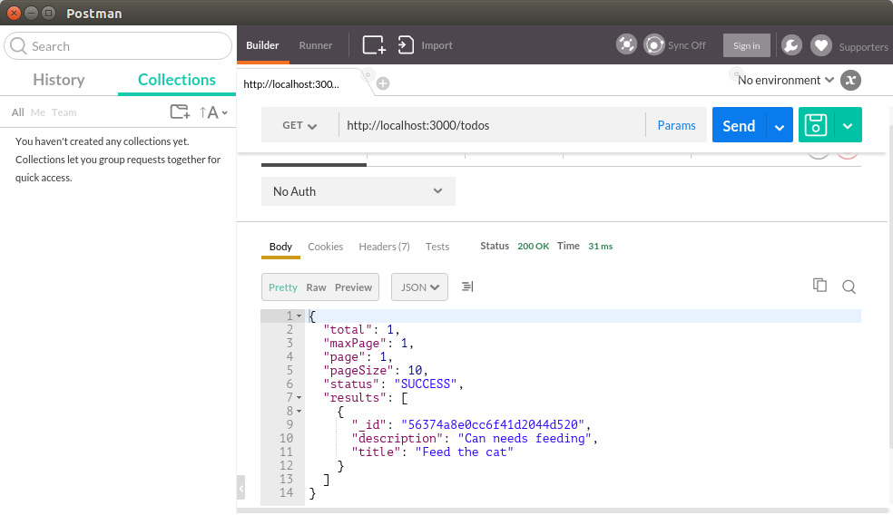

= REST Tutorial

== Introduction

In this tutorial we'll create a simple REST API using the conversation and domain languages.

We'll use the domain language to define a trivial domain model.
Next we'll create a conversation file that defines the REST API.

We'll also generate code and test it all out.

We've provided a video tutorial in addition together with a step-by-step instruction.

== Prerequisites

This tutorial assumes that you already have the conversation with all required tools installed.

== Video Version

== The Steps in text

=== Create the conversation

Open a bash terminal and change directory to a directory of your choosing.
We will create the tutorial project in this directory.

[source,bash]
---------
$ conversation create RESTTutorial
---------

Next we'll *_cd_* into the project.

[source,bash]
---------
$ cd RESTTutorial
---------

=== Remove the demo content from sample file

The +conversation create+ command creates a sample conversation file with the name of the project and the extension +.cl+.
Although we can leave it as is, we'll remove the definition of the agents and types from the file before we begin.

In the editor of your choice, change the content of the +RESTTutorial.cl+ file to only contain the outer definition of the conversation.

[source]
---------
conversation RESTTutorial {

}
---------

=== Define a simple data model

Create a new file in the root directory of your project (this file can actually be put anywhere in your project. We will scan for it and include it in the code generation.).
Name the file +SampleModel.dm+.

This model defines a simple domain model for your project.
We'll define a simple type in the model for now.

Make sure the file contains the content below:

[source]
----------
domain-model SampleModel {
  node-mongo-options {}
  entity TODOItem {
    String title!
    String description?
    Boolean completed?
  }
}
----------

Let's discuss the content of the domain model file.

[source]
----------
domain-model SampleModel {  // <1>
  node-mongo-options {}     // <2>
  entity TODOItem {         // <3>
    ShortId id!             // <4>
    String title!           // <4>
    String description?     // <6>
    Boolean completed?      // <7>
    key(id)                 // <8>
  }
}
----------
<1> The outer definition gives the model a name.
    In our case the name matches that of the file, but it doesn't have to.
<2> The +node-mongo-options+ declaration defines that we want to store the model in MongoDB.
    This declaration can have a set of optional configuration parameters.
    In our case we'll just use open/close curly braces to say we want to use the default setting.
<3> Next we declare an entity called TODOItem.
    Because we have defined the database mapping to be to MongoDB, the entity will become a document in MongoDB.
<4> We're defining a key for the TODOItem.
    This combined with <8> helps us define to MongoDB our key structure.
<5> Next we declare a title of type +String+.
    The exclamation mark at the end of declaration specifies that the field is required.
<6> Next we declare a description of type +String+.
    The question mark at the end of the declaration specifies that the field is optional.
<7> An optional boolean field.
<8> The final declaration specifies what makes a TODOItem unique.

=== Define the extraction type

Now that we have a domain model we'll use it to define a REST resource derived from the domain model.

Open the RESTTutorial.cl file and add the following content.

[source]
----------
conversation RESTTutorial {
  type TodoItem from SampleModel.TODOItem {}

  resource /todos for RESTTutorial.TodoItem offers (create read update delete find) interchanges (json)

}
----------

Let's go through the definitions and discuss the content.

[source]
----------
conversation RESTTutorial {
  type TodoItem from SampleModel.TODOItem {} // <1>

  resource                                   // <2>
    /todos                                   // <3>
    for RESTTutorial.TodoItem                // <4>
    offers (create read update delete find)  // <5>
    interchanges (json)                      // <6>

}
----------
<1> The TodoItem is what we call a projection.
    The projection is based on the TODOItem that we defined in the SampleModel.
    By just providing the open/close braces, we're saying that we want *all* the fields from the declaration of the entity in the domain model.
<2> The +resource+ keyword starts the declaration of a REST resource API.
<3> The +/todos+ defines the URL for the REST resource
<4> The +for+ declaration defines which projection we're using for this resource.
<5> The +offers+ declaration defines which operations we support for the resource.
<6> The +interchanges+ keyword is used to define which media type we support.

=== Generate the code

In your bash shell, run the following commnads:

[source, bash]
-----------
$ npm run gen-src
$ npm run gen-views
-----------

The above commands generates the code.
The first (+gen-src+) generates the code for node.js to run.
The second (+gen-views+) generates an angular application that we'll expand on later.

Note::
  The generation of views may take some time the first time you run it.
  Subsequent runs should take significantly shorter time.

=== Run the node app

If the code generation was successful, you should now be able to start the node application.

[source, bash]
-----------
$ npm start
-----------

A successful start should print out something similar to this:

[source]
---------
$ npm start

> RESTTutorial@0.0.1 start /home/ce/projects/RESTTutorial
> node app.js

SockJS v0.3.8 bound to "/ws/([^/.]+)(/auth/([^/.]+)){0,1}"
2015-11-02T11:28:47.896Z - warn: gridfs not found, skipping.
2015-11-02T11:28:47.899Z - info: ???dev???
2015-11-02T11:28:47.974Z - error: { [Error: connect ECONNREFUSED]
  code: 'ECONNREFUSED',
  errno: 'ECONNREFUSED',
  syscall: 'connect' } 'Error: connect ECONNREFUSED\n    at errnoException (net.js:904:11)\n    at Object.afterConnect [as oncomplete] (net.js:895:19)'
2015-11-02T11:28:47.994Z - info: init socketService
2015-11-02T11:28:48.029Z - info: Gossiping on 127.0.1.1:4000 with seeds:
2015-11-02T11:28:48.176Z - info: Conversation Engine Started. Listening on port(s) 3000
---------

Don't worry about the error that is printed out related to ECONNREFUSED.
A successful start should end with +Conversation Engine Started. Listening on port(s) 3000+.

=== Use Postman to test your REST API

With the server running, you can now test out the REST service that we created.
We created one resource that should be available at the following URL:
  http://localhost:3000/todos

I'm using Postman to test out REST API's (if you don't have Postman, I strongly reccomend the tool, and a simple google search for +postman+ should help you find the tool).

Let's start with a simple POST.
Posting to the resource URL should create a new resource based on the structure passed in the body.

Here is a screen shot of the POST method filled out:

After posting to the server, we should get the new resource in the response body as seen here:

Let's also check to make sure a get request returns the new resource instance. To do so, let's simply do a GET on the resource URL.

=== Generate some U/I

If you have installed the U/I generator, you should also be able to define views over a REST resource.
A simple way to generate such a view is to declare one in the conversation language file (+.cl+).

We'll simply add the following line to the conversation file.

[source]
---------
view /todo over /todos
---------

The complete conversation file should now look like this:

[source]
----------
conversation RESTTutorial {
  type TodoItem from SampleModel.TODOItem {}

  view /todo over /todos
  resource /todos for RESTTutorial.TodoItem offers (create read update delete find) interchanges (json)

}
----------

We have to now generate the user interface code.
Let's just run the generators again:

[source, bash]
-----------
$ npm run gen-src
$ npm run gen-views
-----------

=== Test the generated views

Now that we've generated new code, let's restart the server.

If the server is running: +ctr-c+ to kill the application.
Then run:

[source, bash]
-----------
$ npm start
-----------

You should now be able to launch the application on:
  http://localhost:3000/
