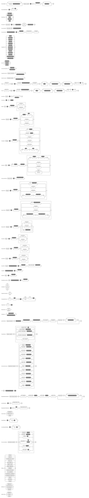

:sectanchors:

= Domain Modeling Language

== Introduction

In almost every software system there is a need for defining an information model.
In most cases, these information models are the foundation for the schema for the persistent storage.
We call these models *Domain Models*.

In addition to provide the foundation for schema defining persistence, the domain model is often created to share the vocabulary and key concepts of the problem domain.

Although some modeling techniques allow the domain model to contain behavior, our domain model is behavior-free.
The reason why we keep the behavior out of the domain model is purely pragmatic.
We've found that the proper way to define behavior depends on what kind of system you're building, while the data structure definitions tend to be system independent.

So with this, perhaps a better name for our domain model is 'Information Domain Modeling Language', but we'll stick to simply 'domain modeling language' here. A commonly used synonym for our kind of model is "Logical Information Model".

The simplest way to think of the domain modeling language is that it allows you to define the rules for a data graph.
This data graph contains objects, properties and relationship.

* *Object*.
An object is a typed hub of information that can be referenced from other objects.
The object has individuality (that is, in the domain, it is important to be able to refer to the object uniquely).
If you are familiar with graph theory, think of the object as a *vertex* (or node) in a graph.
An example of an object could be "John Smith" (of type Person) or "SciSpike" (of type Company).
* *Relationship*.
A relationship is a typed connection between two objects.
In graph theory, this would be called an *edge*.
One important restriction in our "edges" is that they do not carry information (or properties).
This is deliberate.
We believe that if they did, they would have a type name and become identical to the objects.
* *Property*.
A property defines some information that an object 'carries'.
Our properties may be arbitrarily complex, but their complex structure is purely compositional (that is, properties may not contain relationships).

Here are some parallels to other modeling techniques:

* UML.
If you know how to model in Unified Modeling Language (UML), think of the models we create as UML class diagrams where there are no methods.
* ERD.
If you know how to model databases using entity relationship diagrams (ERD) or data definition language (DDL), our domain models are similar but for a few important differences.
** We support relationship natively (you don't need any key / foreign key pairs).
** We support inheritance.
That is, a type may be derived from another type.

We've tried hard to keep the model platform independent.
Our goal is to be able to reuse domain models across different technologies.

== Defining a Domain Model

=== Introduction

The domain model is defined in a simple text file that conforms to a set of grammar rules.
The text file has the extension +.dm+.

Although you may use any text editor you prefer to edit this file, we strongly recommend that you use the editor provided by Yaktor.
This editor is installable into Eclipse.
See here (TBD) for how to install the editor.

The editor will parse the file interactively and mark any errors you may have.
It will also provide auto-completion that dramatically enhances the editing experience.
You may also find the syntax highlighting and the outline view quite useful.

=== Root Constructs

The domain model starts with the definition +domain-model+ followed by the name of the domain model and finally the definition of the domain model in curly braces.

[source,dm]
-----------------
domain-model MyDomainModel {
    // The definition of the model will go here
}
-----------------

=== What Is Contained in the Domain Model?

The domain model allows you to specify the following type of elements:

* link:#entities[Entities]. A type defining kinds of objects.
* link:#associations[Associations]. A type of relationship between objects.
* link:#types[Types]. A composition of link:#fields[fields]
* link:#enums[Enums]. A hard-coded constraint on value.

Let's take a look at an example:

[source,dm]
-----------------
domain-model MyDomainModel {

    type Address {              // <1>
        String street!          // <2>
        String postCode!
        String place!
    }

    entity Pet {                // <3>
        String name!            // <4>
    }

    entity PetOwner {
        String name!
        Address address?        // <5>
    }

    association PetOwnership {  // <6>
        PetOwner owner!   // <7>
        <-->              // <8>
        Pet pets*         // <9>
    }

}
-----------------
<1> We define a data type using the keyword +type+.
A data type defines a structure consisting of properties.
<2> This is a simple example of a primitive property on the type +Address+ of type +String+ called +street+.
The exclamation mark means the that the +street+ property is required (all properties of type Address must have a street).
<3> +Pet+ is a object type. We call these definitions entities and they are denoted with the keyword +entity+.
An entity can be a vertex in a graph.
<4> Notice that we can attach simple properties to the entity directly...
<5> ... or we can attach a complex property (or type) like the +Address+
<6> To allow for links between objects, we can define an +association+.
<7> This association starts at the +PetOwner+. It plays the role +owner+ in this relationship, and all pets have an owner (shown by use of the exclamation mark).
<8> The +<-->+ symbol defines the association to be bidirectional.
    If you wanted the association to be unidirectional, you would would use +-->+ instead.
<9> The association ends in the +Pet+ which plays the role +pets+ to the +PetOwner+. A pet owner may have many pets (denoted by the +*+ relationship).

== Entities

Basically an entity is something that you can retrieve (by id) from storage (like a Database or Document Repository).
Entities are made of link:fields[Fields].

== Types

Types are another basic construct which in a simular sense to link:#entities[Entities] encapsulate link:#fields[Fields].
However Types may not be directly retrieved. They can more-or-less be seen as a logical grouping of fields, which are otherwise fully contained within an enclosing Entity.

== Fields

Fields can express value, reference, or composition. Value fields are either of link:#primitive-types[Primitive Types] or link:#enums[Enums].
reference are made using +ref+ to a link:#entities[Entity]. Finally, compostion is made by using a named type construct to a link:#types[Type]

=== Primitive Types

Both entities and types may define properties.
The atomic properties are constrained to a set of primitive types:

* +Amount+. Very often we want entities to hold some monetary value.
* +Any+. Some information that is not typed.
* +Boolean+. True or false.
* +Count+. A count (typically a positive integer value).
* +Date+. A point in time.
* +EntityReference+. A reference to another entity.
* +GeoLocation+. A map location.
* +Id+. A type which is suitable for the target environment to be auto-generated and unique (system wide).
* +Integer+. An integer value.
* +Numeric+. Any numeric value (including decimal point value).
* +Price+. A price (typically for a product).
* +ShortId+ A generated user friendly Id.
* +String+. A sequence of characters.

The properties may define further constraint over their values.

=== Cardinality

All properties may define cardinality.
The cardinality is defined using a character after the name of the properties.
We currently support the following cardinalities:

[cols="1,4", options="headers"]
|===

|Cardinality
|Semantics

| +?+
| *Optional*. The field may or may not be present (or may be null).

| +!+
| *Required*. The field must be present (or can not be null).

| +*+
| *Many*. The field can contain a collection of any number of values (including 0) or it may be null or not present at all.

| +++
| *One or more*. The field contains a collection of at least one value.

|===

=== Uniqueness

Each of the properties may define uniqueness. This is simply defined with the keyword +unique+ succeeding the property definition.

[source,dm]
--------
entity Person {
    String ssn! unique      // <1>
    String name!
}
--------
<1> The +ssn+ property (Social Security Number) is defined to be unique. That is, there should not be two people with the same +ssn+ property.

=== Constraints on Strings

String can be constrained based on a regular expression or by simply defining its length.

==== Reg-Ex Constraints

[source,dm]
--------
entity Person {
    String ssn! pattern "^\\d{3}-\\d{2}-\\d{4}$"    // <1>
}
--------
<1> Here we have constrained the +ssn+ property to be a valid US social security number.

Notice that to constrain a string based on a reg-ex pattern, we simply provide the keyword +pattern+ followed by a quoted string.
Notice, in the string, we have to escape the +\+.

==== String Length Constraint

[source,dm]
--------
entity Person {
    String lastName! [2..100]   // <1>
}
--------
<1> The last name has to be at least 2 characters but no more than 100

To specify the string length, use the square brackets. and the following format:

+[+ +min+ +..+ +max+ +]+

The min and max is optional. Here are some examples:

* +[..1000]+. The string must be less than 1000 characters in length.
* +[2..]+. The string must be at least 2 characters in length (but can be as long as the platform allows).

=== Constraints on Dates

The dates can be constrained to the past, the future or to a specified date range.

==== Past and Future

[source,dm]
--------
entity Person {
    Date whenBorn! past                 // <1>
    Date scheduledNextFollowup future   // <2>
}
--------
<1> The +whenBorn+ property must be in the past.
<2> The +scheduledNextFollowup+ property must be in the future

==== Specifying Date Ranges

TBD (we're using the square bracket, but we don't seem to use it right now. We need to define the format of the date...)

=== Constraints on Integers and Numerics

Integer only supports a simple constraint defining a range.

[source,dm]
--------
entity Person {
    Integer age [0..150]        // <1>
}
--------
<1> The age is constrained to be a value between 0 and 150 (inclusive).

To constrain an integer or a numeric to specified range, use square brackets and the format:

+[+ +min+ +..+ +max+ +]+

Note here (as for other ranges) that the min and max is optional.

== Keys

For most models you may not need to concern your self with keys, in general a id field appropriate to the target
environment will be created automatically. However sometimes you will want to either controll the presented name
or type of that field throughout the domain. To do so is simple simply call out a +key+ as follows:

[source,dm]
--------
entity WithId {
    Id id                  // <1>
    key (id)               // <2>
}
--------
<1> A field of any type or name.
<2> describe which field you want to be the entitie's key.

== Enums

The language also allows you to introduce enumerated types.
An enumerated type allows you to define a domain consisting of a set of named values.

[source,dm]
--------
enum Gender {               // <1>
    M = "Male"              // <2>
    F = "Female"
}
entity Person {
    enum Gender gender!     // <3>
}
--------
<1> Here we are introducing a enumerated type called +Gender+.
<2> We are defining the valid values. +M+ is the actual valid value, +"Male"+ is the human readable designation.
<3> The +Person+ type defines that it has a +gender+ field of type +Gender+.

Enumerated types are introduced using the keyword +enum+.
The enumerated values are defined in the format:

+ComputerValue+ +=+ +"Human readable Value"+

Enumerated properties can be used by both entities and types.

== Associations

Associations can be defined two ways:

* **Recommended:** By an explicit construct, using the keyword +association+.
* By using a reference property

Although we recommend that you use the explicit association, we've found some domains where the use of reference properties may be more natural.

=== Defining an Association Using the +association+ Keyword

[source,dm]
-----------------
domain-model MyDomainModel {

    entity Pet {
        String name!
    }

    entity PetOwner {
        String name!
    }

    association PetOwnership {      // <1>
        PetOwner owner!             // <2>
        <-->                        // <3>
        Pet pets*                   // <4>
    }

}
-----------------
<1> Define an association named +PetOwnership+.
<2> Define the 'originating type' to be the +PetOwner+ and the role it plays to be +owner+.
<3> +<-->+ indicates that the association is bidirectional.
<4> Define the 'destination type' to be the +Pet+ and the role it plays to be +pets+.

For most platforms, this distinction is typically not important (e.g., in a relational database, the association would be bidirectional). Some platforms, however (e.g., most graph databases), the direction of the association may be of importance.

You can also define unidirectional associations.
Unidirectionality may end up being just a hint to the code generator, but the implied semantic is:

* I need to resolve the latter object(s) when I know an instance of the first object.
* I don't need to resolve the first object(s) given an instance of last object.

As mentioned, this would be nonsensical in a relational database, but it may very well be a good hint for when you want to generate some object-relational mapping on top of the database.
We may want to be able to lookup the pets from the pet owner, but not allow for pets to 'know' their owner.

If we wanted to define this, we would have to change the association as follows:

[source,dm]
-----------------
association PetOwnership {
    PetOwner owner!
    --> <1>
    Pet pets*
}
-----------------
<1> Using the +-->+ separation of the two association end rather than +<-->+ to indicate that we believe the lookup would be from owner to pets only

=== Defining Associations as References

We said that a non-preferred way to define associations is to use references.
Let's say we want to define the same association as previously (PetOwner to Pet).
We could do so by simply defining an property on either side.

[source,dm]
-----------------
domain-model MyDomainModel {

    entity Pet {
        String name!
    }

    entity PetOwner {
        String name!
        ref Pet pets*               <1>
    }
}
-----------------
<1> We're defining that the pet owner will have a property which is a reference to all of its pets.

An alternative, of course, would be to define the reference on the +Pet+ side.

[source,dm]
-----------------
domain-model MyDomainModel {

    entity Pet {
        String name!
        ref PetOwner owner!         <1>
    }

    entity PetOwner {
        String name!
    }
}
-----------------
<1> Here we've defined the relationship on the pet side.
Although somewhat imprecise, we're saying that the pet 'knows' its owner.

This method may be appealing to someone used to a language with no explicit support for relationship (e.g., Java, C++, etc. that only have unidirectional pointers or references). However, it is important to understand that we are providing a rather incomplete association and that the code generator has to use the most general case implementation.

When using references, we are not specifying the role or multiplicity of the 'other side'. In other words, when we read the examples above, I don't know the multiplicity of the non-specified case.

Let's take the case where the +PetOwner+ defines the reference to his/her pets.

* Can a +Pet+ have multiple owners?
* Can a +Pet+ not have an owner?

In the case when we defined the association explicitly (even if it is unidirectional), we had to make a decision.

Because we have not specified the opposite cardinality, the code generator typically have to assume the most general case.
In our example, the generator would use:

[source,dm]
-----------------
association PetOwnership {
    PetOwner petOwner*    // <1>
    -->                   // <2>
    Pet pets*
}
-----------------
<1> We don't really know the cardinality nor the role name.
We use the more general case +*+ (many) and guess that the role name is the same as the type +petOwner+ in this case.
<2> Unidirectional: we go from petOwner to pets

Hopefully that has convinced you to use the association construct when you have options.

There is, however, a case where the +ref+ construct is useful.
This is when you have to provide a link to an entity from within a type structure.

As we mentioned before, we can only link from entity to entity. However, sometimes we may want to have a simple property on a type that refers to another entity.

== Composite Field Uniqueness

Sometimes we want to express that a combination of properties makes an entity unique.
Let's say for instance that we have a location where we want the city name and state to be unique (example, we have Rochester in both Minnesota and New York, however the City Name + State should always be unique).

[source,dm]
-----------------
entity City {
    String name!
    String state!
    unique-constraint name state    // <1>
}
-----------------
<1> The uniqueness constraint specifying that the combination of name and state should be unique

To specify the cross-field uniqueness constraint, you must (as the last thing defined on the type) define the following:

*+uniqueness-constraint+* +property1 [property2 ...]+

== Indexing Hint

You can define in the domain language that one or more properties shall be indexed.
The indexing is just a hint to the code generators.
To suggest the use of indexing, simply add the keyword +indexed+ to the property.

[source,dm]
-----------------
entity City {
    String name! indexed    // <1>
    String state!
}
-----------------
<1> Suggest to the code generators that the name ought to be indexed.

== Partition of Models

Sometimes it is practical to split the model into several files. If you want to use a model from another model, you will need to import it.

To import another model, you have to declare your import statements at the top of your file in the following syntax:

+import+ +ModelName+

Wherever you use the types / entities from the foreign model you'll now have to qualify the name by using the following syntax:

+ModelName+ +.+ +TypeName+

Here is a simple example:

[source,dm]
-----------------
import ForeignModel                             // <1>

domain-model MyModel {

    entity MyEntity {
        ForeignModel.ForeignType someField!     // <2>
    }

    association SomeAssociation {
        MyEntity m?
        <-->
        ForeignModel.ForeignEntity fe!      // <3>
    }
}
-----------------
<1> Import another model called +ForeignModel+
<2> Use some externally defined type called +ForeignType+ in this model
<3> Use some externally defined entity called +ForeignEntity+ in this association.

== Extensions

There are several features that only present themselves through the use of the extension section of the output configuration.

=== Single Table Root

When you express a model with polymorphic entities it may be advantageous to have sibling Entities of a hierarchy (subClasses) persist to a single storage location.
Single Table Root overrides the default behavior (persist to a different location for all subclasses). When a entity (abstract or not) is
specified as the Single Table Root all of its subClasses would be persisted in the same location. For this to work correctly all fields of subClasses should be optional.

[NOTE]
.Mongo is the Exception to the Rule
====
In Mongo, schema enforcement is done on the client side. Therefore you can have required fields in a subClass using Single Table Root.
====

[source,dm]
.SingleTableRoot.dm
-----------------
domain-model SingleTableRoot {
    node-mongo-options {
      extensions {
        Super {
          single-table-root       // <1>
        }
      }
    }
    abstract entity Super {
      String superAttr
    }

    entity SubA extends Super {
      String aAttr?
    }
    entity SubB extends Super {
      String bAttr               // <2>
    }
}
-----------------
<1> Specify that Super should be a Single Table Root for all of its subClasses
<2> Taking advantage of the fact that Mongo is cool and having a required field on a subClass with Single Table Root.

=== Time To Live

A feature of Mongo is to have records "Die" at a prescribed date. This is achieved by specifying a Time To Live (TTL) index.
Basically there is a background task run on the Mongo Storage Nodes which cleans up records which have outlived their TTL.
TTL is expressed as seconds past the date value of a field.

[source,dm]
.ttl.dm
-----------------
domain-model TimeToLive {
    node-mongo-options {
      extensions {
        Session {
          ttl expires 0       // <1>
          /*
          ttl bornOn 86400    // <2>
          */
        }
      }
    }
    entity Session {
      // ...
      Date expires            // <3>
      Date bornOn             // <4>
    }
}
-----------------
<1> wish to delete records at a specified Date
<2> wish to delete records after a specified time has passed
<3> A Field who's value specifies when the record should be removed.
<4> A Field who's value "+" the ttl seconds could indicate when the record should be removed.

[TIP]
====
One advantage of the ttl 0 pattern is that it leaves the lifetime of a record as a runtime decision. Where as,
with the ttl 86400 pattern, the .dm controls the lifetime.
====

== Graphical View of the Model

As you build up your model, the editor (assuming you're editing in Eclipse) will keep your model synchronized with a graphical view.
The graphical view is a UML class diagram.
You'll find your model under your project root in the directory +src-gen/dot/domain/${DomainModelName}.dot+.
The internal format for the class diagram is a standard DOT notation (see http://en.wikipedia.org/wiki/DOT_language), from which we render the UML class diagram.

There are multiple tools that can render this notation.
The most popular one is probably graphviz.
Graphviz can be obtained for free from http://www.graphviz.org/.

== Code Generation

After you've created your model, you typically want to generate something from it.
We support a set of code generators.
Which code generator to use is specified by adding a configuration section to the top of the file.
You determine which code generator to activate by selecting a particular configuration.

This article is focusing on the language itself. If you want to know about the specific generators, see one of these articles:

* link:node/mongo/gen-mongo-js.html[Generate node.js and mongoose]
* Generate Spring JPA (TBD Add link)

== Syntax Graph

