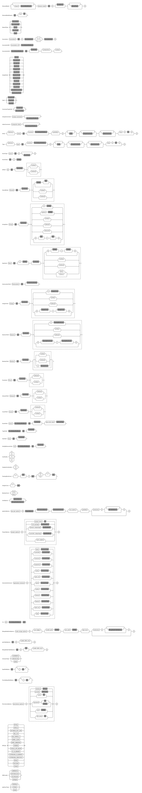

= Yaktor Domain Modeling Language

== Introduction

In almost every software system there is a need for defining an information model.
In most cases, these information models are the foundation for the schema for the persistent storage.
Yaktor calls these models *Domain Models*.

In addition to providing the foundation for the schema governing persistence, the domain model is often created to share the link:http://martinfowler.com/bliki/UbiquitousLanguage.html[vocabulary and key concepts, or "ubiquitous language"^], of the problem domain.

Although some modeling techniques allow the domain model to contain behavior, Yaktor's domain model is generally devoid of behavior.
The reason why Yaktor favors behaviorless domain models is purely pragmatic; data structures tend to be independent of the underlying implementation, whereas behavior is typically imperative and is influenced by the implementation language.

With this, perhaps a better name for Yaktor's domain model is "information domain modeling language" or "logical information model", but we'll stick to simply "domain modeling language" here.

The simplest way to think of the domain modeling language is that it allows you to define the rules for a data graph.
This data graph contains _objects_, _properties_ and _relationships_.

* *Object*:
An object is a typed tuple of information that can be referenced from other objects.
The object has unique identity; that is, in the domain, it is important to be able to refer to the object uniquely.
If you are familiar with graph theory, think of the object as a _vertex_ or _node_ in a graph.
Examples include a person with name "John Smith" or a company with name "SciSpike".

* *Relationship*:
A relationship is a typed association between two objects.
In graph theory, this would be called an *edge*.
One important restriction between Yaktor's relationships and graph edges is that relationships deliberately do _not_ have properties.
Yaktor takes the stance that if edges had properties, then they'd be indistinguishable from objects.

* *Property*:
A property defines some datum that partially describes an object.
Properties may be arbitrarily complex, but they may not contain relationships.

Here are some parallels to other modeling techniques:

* *Unified Modeling Language (UML)*:
If you know how to model in link:https://en.wikipedia.org/wiki/Unified_Modeling_Language[UML^], think of the models we create as UML class diagrams where there are no methods.
* *Entity-Relationship Model (ERD)*:
If you know how to model databases using link:https://en.wikipedia.org/wiki/Entity%E2%80%93relationship_model[ERDs^] or link:https://en.wikipedia.org/wiki/Data_definition_language[data definition language (DDL)^], our domain models are similar except for a few important differences.
** Yaktor supports relationships natively; link:https://en.wikipedia.org/wiki/Foreign_key[foreign keys^] are unnecessary.
** Yaktor supports link:https://en.wikipedia.org/wiki/Inheritance_(object-oriented_programming)[single inheritance^] among types.
That is, a type may be derived from exactly on other type.

IMPORTANT: Since the goal of Yaktor's domain modeling DSL is to reuse domain models across different technologies, it attempts keep the model platform-independent.

== Defining a Domain Model

=== Introduction

The domain model is defined in a simple text file that conforms to a set of grammar rules.
Yaktor domain model files can have any extension, but the preferred extension is `.ydm`.

TIP: Although you may use any text editor you prefer to edit this file, the Yaktor team strongly recommends that you use the editor provided by Yaktor.
It is provided as an eclipse plugin, available at http://yaktor.io/eclipse.

The editor will parse the file interactively and mark any errors you may have.
It also provides autocompletion, syntax highlighting, and an outline view, which are quite useful.

=== Declaration
The domain model starts with the declaration `domain-model` followed by the name of the domain model, then the definition of the domain model in curly braces.

[source,ydm]
----
domain-model MyDomainModel {
    // The definition of the model will go here
}
----

=== What Is Contained in the Domain Model?

The domain model allows you to specify the following type of elements:

* link:#entities[Entities]. A type defining kinds of objects.
* link:#associations[Associations]. A type of relationship between objects.
* link:#types[Types]. A tuple of link:#fields[fields], possibly based on an entity.
* link:#enums[Enums]. A type with fixed values defined at design time.

Let's take a look at an example:

[source,dm]
-----------------
domain-model MyDomainModel {

    type Address {              // <1>
        String street!          // <2>
        String postCode!
        String place!
    }

    entity Pet {                // <3>
        String name!            // <4>
    }

    entity PetOwner {
        String name!
        Address address?        // <5>
    }

    association PetOwnership {  // <6>
        PetOwner owner!   // <7>
        <-->              // <8>
        Pet pets*         // <9>
    }
}
-----------------
<1> `type` defines a data structure, consisting of properties of simple types or other `type` s.
<2> This is a simple example of a primitive property on the type `Address` of type `String` called `street`.
The exclamation mark means the that the `street` property is required; in other words, all properties of type `Address` must have a `street`.
<3> `entity` defines a `Pet` as a persistent object.
An `entity` can be a vertex in a graph.
<4> Notice that we can attach simple properties to the entity directly...
<5> ... or we can attach a complex `type` property like `Address`
<6> To allow for links between objects, you can define an `association`.
<7> This `association` starts at the `PetOwner`. It plays the role `owner` in this relationship, and all `pet` s have an `owner`, by virtue of the exclamation point.
<8> The `<-->` symbol defines the association to be _bidirectional_.
If you wanted the association to be unidirectional from `PetOwner` to `Pet`, you would would use `-->` instead.
<9> The association ends in the `Pet`, which plays the role `pets` to the `PetOwner`. A `PetOwner` may have many `pets`, denoted by the cardinality indicator `*`, meaning "0 or more".

== Entities

Basically an entity is something that you can retrieve (by id) from storage (like a Database or Document Repository).
Entities are made of link:fields[Fields].

== Types

Types are another basic construct which in a simular sense to link:#entities[Entities] encapsulate link:#fields[Fields].
However Types may not be directly retrieved. They can more-or-less be seen as a logical grouping of fields, which are otherwise fully contained within an enclosing Entity.

== Fields

Fields can express value, reference, or composition. Value fields are either of link:#primitive-types[Primitive Types] or link:#enums[Enums].
reference are made using `ref` to a link:#entities[Entity]. Finally, compostion is made by using a named type construct to a link:#types[Type]

=== Primitive Types

Both an `entity` and a `type` may define properties.
Properties may be a `type` or one of the following primitives:

* `Amount`. A monetary value.
* `Any`. Untyped information.
* `Boolean`. A literal `true` or `false`.
* `Count`. A positive integer value.
* `Date`. An instant in time.
* `EntityReference`. A reference to an `entity`.
* `GeoLocation`. A map location.
* `Id`. A type which is suitable for the target environment to be auto-generated and unique (system-wide).
* `Integer`. An integral value.
* `Numeric`. Any numeric value, including decimal values.
* `Price`. A price.
* `ShortId`. A generated user friendly identifier.
* `String`. A sequence of characters.

Properties may define further constraints on their values.

=== Cardinality
All properties may define a cardinality.
The cardinality is defined using a suffix on the property.
We currently support the following cardinalities:

[cols="1,4", options="headers"]
|===

|Cardinality
|Semantics

| `?`
| *Optional*: zero or one. The field may or may not be present.

| `!`
| *Required*: exactly one. The field must be present & non-null.

| `*`
| *Many*: zero or more. The field can contain a collection of any number of values, including 0, or it may be null or not present at all.

| `+`
| *At least one*: one or more. The field contains a collection of at least one value.

|===

=== Uniqueness
Each of the properties may define uniqueness. This is simply defined with the keyword `unique` succeeding the property definition.

[source,dm]
--------
entity Person {
    String ssn! unique      // <1>
    String name!
}
--------
<1> The `ssn` property is defined to be unique. That is, there should not be two instances of `entity` `Person` with the same `ssn` value.

=== Constraints on Strings
`String` can be constrained based on a regular expression or by simply defining its length.

==== Reg-Ex Constraints
[source,dm]
--------
entity Person {
    String ssn! pattern "^\\d{3}-\\d{2}-\\d{4}$"    // <1>
}
--------
<1> The constraint on the `ssn` property is to be a valid US social security number.

Notice that to constrain a string based on a reg-ex pattern, we simply provide the keyword `pattern` followed by a quoted string.

NOTE: When using regular expressions, backslashes must be escaped.

==== String Length Constraint
[source,dm]
--------
entity Person {
    String lastName! [2..100]   // <1>
}
--------
<1> The last name has to be at least 2 characters but no more than 100

To specify the string length, use the following format:

`[` _min_ `..` _max_ `]`

NOTE: The _min_ and _max_ values are optional.

Here are some examples:

* `[..1000]`: the string must be less than 1000 characters in length.
* `[2..]`: the string must be at least 2 characters in length and as long as the underlying platform allows.

=== Constraints on Dates
The dates can be constrained to the past or future relative to the current system time, or to a specified date range.

==== Past and Future
[source,dm]
--------
entity Person {
    Date birthdate! past     // <1>
    Date nextFollowup future // <2>
}
--------
<1> The `birthdate` property must be in the past.
<2> The `nextFollowup` property must be in the future.

==== Specifying Date Ranges
TBD (we're using the square bracket, but we don't seem to use it right now. We need to define the format of the date...)

=== Constraints on Integers and Numerics
`Integer` only supports a simple constraint defining a range.

[source,dm]
--------
entity Person {
    Integer age [0..150]        // <1>
}
--------
<1> The age is constrained to be a value between 0 and 150 (inclusive).

To constrain an integer or a numeric to specified range, use square brackets and the format:

`[` _min_ `..` _max_ `]`

NOTE: The _min_ and _max_ values are optional.

== Keys
For some models, you may not need to concern yourself with keys; in general, an id field appropriate for the target environment will be created automatically.
However, you may want to control the name or type of the `id` field throughout the domain.
To do so, simply define a unique key as follows:

[source,dm]
--------
entity SomethingWithId {
    Id id                  // <1>
    key (id)               // <2>
}
--------
<1> A field of any type or name, representing the unique key.
<2> Describe which field you want to be the `key` of the `entity`.

== Enums
The language also allows you to define enumerated types.
An enumerated type allows you to define a domain consisting of a set of named values.

[source,dm]
--------
enum Gender {                                         // <1>
    M = "Biologically Male"                           // <2>
    F = "Biologically Female"
    MF = "Biological Male Self-Identifying as Female"
    FM = "Biological Female Self-Identifying as Male"
    HM = "Hermaphrodaic Self-Identifying as Male"
    HF = "Hermaphrodaic Self-Identifying as Female"
    A = "Ambiguous"
}
entity Person {
    enum Gender gender!                                // <3>
}
--------
<1> Declare an enumerated type called `Gender`.
<2> Define the only valid values of the `enum` `Gender`.
<3> The `Person` type defines that it has a `gender` field of type `Gender`.

Enumerated types are introduced using the keyword `enum`.
The enumerated values are defined in the following format:

_Symbol_ `=` `"` _Value_ `"`

Enumerated properties can be used in an `entity` and a `type`.

NOTE: Enumerated properties on an `entity` must be prefaced with `enum`.
On a `type`, simply use the value; there must be no introduction.

== Associations
Associations can be defined two ways:

* by an explicit construct, using the keyword `association` (*recommended*), or
* by using a reference property with keyword `ref`.

NOTE: Although explicit `association` declarations are recommended, there are domains where the use of `ref` properties may be more natural.

=== Using the `association` keyword
[source,dm]
-----------------
domain-model MyDomainModel {

    entity Pet {
        String name!
    }

    entity PetOwner {
        String name!
    }

    association PetOwnership {      // <1>
        PetOwner owner!             // <2>
        <-->                        // <3>
        Pet pets*                   // <4>
    }
}
-----------------
<1> Define an association named `PetOwnership`.
<2> Define the originating type to be the `PetOwner` and the role it plays to be `owner`.
<3> `<-->` indicates that the association is bidirectional.
<4> Define the destination type to be the `Pet` and the role it plays to be `pets`.

For most platforms, this distinction is typically not important, like in a relational database.
However, on some platforms, like graph databases, the direction of the association may be significant.

You can also define unidirectional associations.
Unidirectionality may end up being just a hint to the code generator, but the implied semantic is:

* I need to resolve the destination object(s) when I know an instance of the originating object.
* I don't need to resolve the originating object(s) given an instance of destination object.

As mentioned, this would be nonsensical in a relational database, but it may very well be a good hint for when you want to generate some object-relational mapping.
We may want to be able to lookup the pets from the pet owner, but not allow for pets to effectively know their owner directly.

If we wanted to define this, we would have to change the association as follows:

[source,dm]
-----------------
association PetOwnership {
    PetOwner owner!
    -->             // <1>
    Pet pets*
}
-----------------
<1> Using the `-->` associator to indicate that we believe the lookup would be only from owner to pets

=== Using the `ref` keyword

We said that another way, although not preferred, to define associations is to use references via the keyword `ref`.
Let's say we want to define the same association as befroe (`PetOwner` to `Pet`).
We could do so by simply defining an property on either side.

[source,dm]
-----------------
domain-model MyDomainModel {

    entity Pet {
        String name!
    }

    entity PetOwner {
        String name!
        ref Pet pets*               <1>
    }
}
-----------------
<1> Define the `PetOwner` will have a property which is a reference to all of its `pets`.

An alternative, of course, would be to define the reference on the `Pet` side:

[source,dm]
-----------------
domain-model MyDomainModel {

    entity Pet {
        String name!
        ref PetOwner owner!         <1>
    }

    entity PetOwner {
        String name!
    }
}
-----------------
<1> Define the relationship on the `pet` side of the association.
Although somewhat imprecise, this indicates that the pet maintains a reference to its `owner`.

This method may be appealing to someone accustomed to a language with no explicit support for relationship (for example, Java & C++, that only have unidirectional references or pointers, respectively).
However, it is important to understand that we are providing a rather incomplete association and that the code generator has to use the implementation for most general case.

When using references, we are not specifying the role or multiplicity of the destination side.
In other words, when we read the examples above, one doesn't know the multiplicity of the non-specified case.

Let's take the case where the `PetOwner` defines the reference to his `pets`.

* Can a `Pet` have multiple owners?
* Can a `Pet` not have an owner?

In the case when we defined the `association` explicitly, even if it is unidirectional, we had to make a decision.

Because we have not specified the opposite cardinality, the code generator typically has to assume the most general case.
In our example, the generator would use:

[source,dm]
-----------------
association PetOwnership {
    PetOwner petOwner*    // <1>
    -->                   // <2>
    Pet pets*
}
-----------------
<1> We don't really know the cardinality or the role name.
We use the more general case `*` ("0 or more") and guess that the role name is the same as the type `petOwner` in this case.
<2> Unidirectional: navigability is from `petOwner` to `pets`

Hopefully that has convinced you to use the `association` form when you have options.

There is, however, a case where the `ref` construct is useful.
This is when you have to provide a link to an entity from within a `type`.

As we mentioned before, we can only link from one `entity` to another `entity`.
However, sometimes, we may want to have a simple property on a type that refers to another entity.

== Composite Uniqueness

Sometimes we want to express that a combination of properties makes an entity unique.
Let's say for instance that we have a location where we want the city name and state to be unique.
For example, since Rochester exists in both Minnesota and New York, the city name and state combination should always be unique.

[source,dm]
-----------------
entity City {
    String name!
    String state!
    unique-constraint name state    // <1>
}
-----------------
<1> The uniqueness constraint specifying that the combination of `name` and `state` should be unique

To specify the cross-field uniqueness constraint, you must define the following:

`unique-constraint` _property1_ _property2_ ...

NOTE: `unique-constraint` must be the last declaration in an `entity` body.

== Index Hint

You can define in the domain language that one or more properties shall be indexed.
The indexing is just a hint to the code generators.
To suggest the use of indexing, simply add the keyword `indexed` to the property.

[source,dm]
-----------------
entity City {
    String name! indexed    // <1>
    String state!
}
-----------------
<1> Suggest to the code generators that `name` should be indexed.

== Partition of Models
Sometimes it is practical to split the model into several files.
If you want to use a model from another model, you will need to import it.
To import another model, you have to declare import statements at the top of your file in the following syntax:

`import` _ModelName_

Wherever you use a `type` or `entity` from the foreign model, you'll have to fully qualify its name by using the following syntax:

_ModelName_ `.` _TypeName_

Here is a simple example:

[source,dm]
-----------------
import ForeignModel                             // <1>

domain-model MyModel {

    entity MyEntity {
        ForeignModel.ForeignType someField!     // <2>
    }

    association SomeAssociation {
        MyEntity m?
        <-->
        ForeignModel.ForeignEntity fe!      // <3>
    }
}
-----------------
<1> Import another model called `ForeignModel`
<2> Use the externally defined type called `ForeignType` in this model
<3> Use the externally defined entity called `ForeignEntity` in this association.

== Extensions
There are several features that only present themselves through the use of the extension section of the output configuration.

=== Single Table Root

When you express a model with polymorphic entities, it may be advantageous to have the entire inheritance hierarchy persist to a single storage location (table, collection, column family, etc).
`single-table-root` overrides the default behavior, which is to persist to a different location for all subclasses.
When a entity (abstract or not) is specified as the `single-table-root`, all of its subclasses are persisted in the same location.

NOTE: When using `single-table-root`, all fields of subclasses should be optional.

IMPORTANT: In MongoDB, schema enforcement is done on the client side.
Therefore, you _can_ have required fields in a subclass with `single-table-root`.

[source,dm]
.Single table root example
-----------------
domain-model Folks {

    node-mongo-options {
      extensions {
        Person {
          single-table-root       // <1>
        }
      }
    }

    abstract entity Person {
      String superAttr
    }

    entity Superhero extends Person {
      String strength?
    }

    entity Employee extends Person {
      String badgeId              // <2>
    }
}
-----------------
<1> Specify that there should be a single storage location for `Person` and all of its subclasses.
<2> This takes advantage of the fact that if you're using MongoDB, you can have a required field on a subclass even with `single-table-root`.

=== Time To Live

Another feature of some stores (like MongoDB) is to have records deleted at a prescribed date.
This is achieved by specifying a Time To Live (TTL) index.
Basically, there is a background task run on the storage engine which cleans up records which have outlived their TTL.
In some stores, TTL can be expressed as seconds past the date value of a field.

[source,dm]
.Fixed time to live example using MongoDB
-----------------
domain-model FixedTimeToLive {

    node-mongo-options {
      extensions {
        Session {
          ttl expires 0       // <1>
        }
      }
    }

    entity Session {
      Date expires            // <2>
    }
}
-----------------
<1> We wish to delete records at a specified instant.
<2> A field whose value specifies when the record should be removed.

[source,dm]
.Relative time to live example using MongoDB
-----------------
domain-model RelativeTimeToLive {

    node-mongo-options {
      extensions {
        Session {
          ttl born 86400    // <1>
        }
      }
    }

    entity Session {
      Date born             // <2>
    }
}
-----------------
<1> We wish to delete records after a specified time has passed.
<2> A field whose value plus the `ttl` seconds could indicate when the record should be removed.

TIP: One advantage of the `ttl expires 0` example is that it leaves the lifetime of a record as a runtime decision, whereas, with the `ttl born 86400` pattern, the lifetime is determined at design time.

== Graphical View of the Model

As you build up your model, the editor (assuming you're editing in Eclipse) will keep your model synchronized with a graphical view.
The graphical view is a UML class diagram in link:http://en.wikipedia.org/wiki/DOT_language[standard DOT notation^].
You'll find your model under your project root in the directory `src-gen/dot/domain/${DomainModelName}.dot`.

There are multiple tools that can render this notation.
We've tested with and recommend link:http://www.graphviz.org/[GraphViz^], a free tool.

== Syntax Graph
Here is a convenient graph of Yaktor's domain model DSL grammar:

